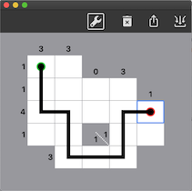
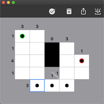

# MathMazer

There is not a lot of information on this type of math maze online, but they (used to be) a staple of Dell puzzle magazines. There is a brief description of the puzzle style [here](http://www.mit.edu/activities/puzzle/2013/coinheist.com/oceans_11/random_walk/index.html).

## Example Mazes
### [Tiny Maze](./tiny.maze)

### [Maze 1](./maze1.maze)

### [Maze 2](./maze2.maze)

## Requirements
MacOS 10.15

## Controls
### Control Bar
1. Click the wrench/checkmark to toggle between the design and play modes.
2. Click the trashcan to clear a maze while playing or start a new maze while designing.
3. Click the export button to save a maze (also saves whether the maze is currently being designed or played).
4. Click the crazy icon on the far right to open a maze.

### Design Mode
**Click** a cell to toggle it as in or out of the playable area.

**Shift+Click** a cell to turn it into a start cell (green dot). **Shift+Click** again to turn it into an end cell (red dot).

**Click** a start or end cell to select it.

Use the **arrow keys** to draw a maze.

**Ctrl+Click** on a maze cell to clear that cell. **Ctrl+Click** on a start/end cell without any maze to remove the start/end marker.

### Play Mode
**Click** a cell to add a dot (indicating the cell is part of the maze, but you are not sure how the maze passes through that cell yet).

**Shift+Click** a cell to toggle a "blank" on and off. Use this to indicate you've ruled a cell out as part of the maze.

**Click** a start, end, or dot cell to select it.

Use the **arrow keys** to draw a maze. You can draw onto cells that do not yet have dots; a dot will be added to the cell in addition to a maze segment.

**Ctrl+Click** a cell to clear maze lines if there are any. **Ctrl+Click** a cell with no maze lines to delete a dot.
